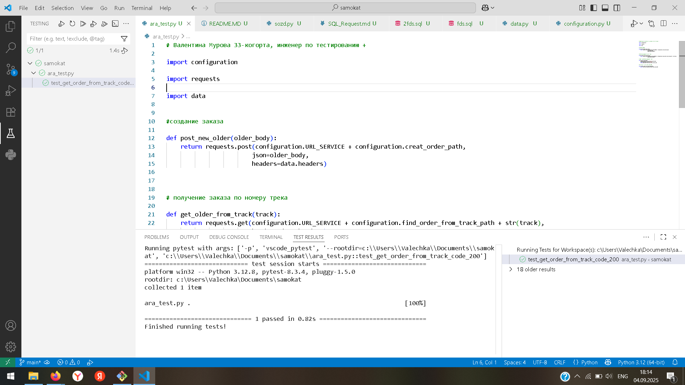
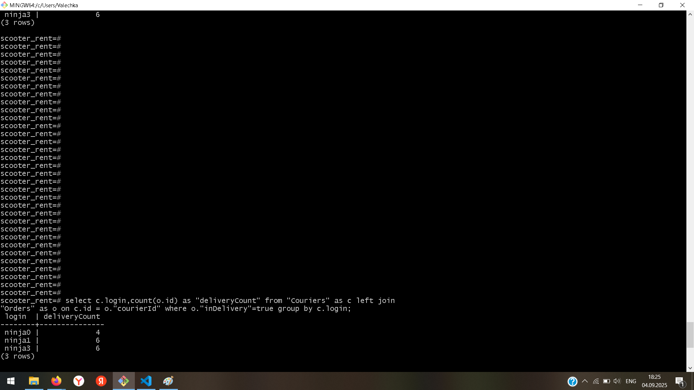
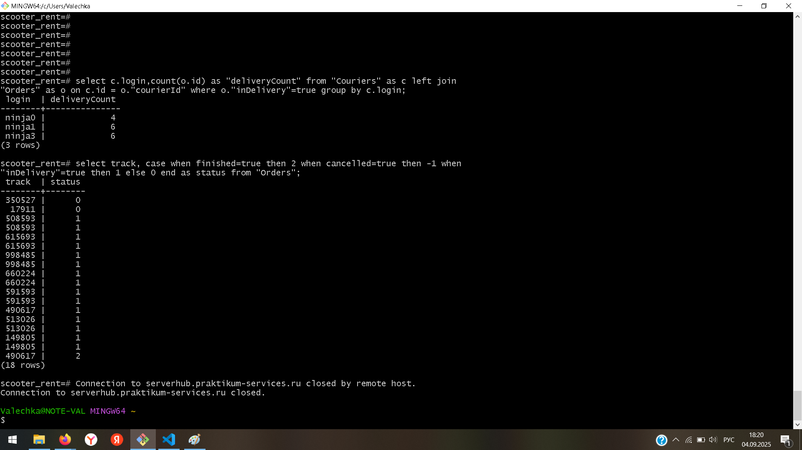

# Автоматизация теста к API

Валентина Мурова, 33-когорта, Инженер по тестированию+

## Автоматизируй сценарий:

- Клиент создаёт заказ.

- Проверяется, что по треку заказа можно получить данные о заказе.

## Шаги автотеста:

1. Выполнить запрос на создание заказа.

1. Сохранить номер трека заказа.

1. Выполнить запрос на получение заказа по треку заказа.

1. Проверить, что код ответа равен 200.

## Работа с БД.

Для выполнение запросов в БД были созданы курьеры и заказы, заказы распределены по курьерам.

[скрипт наполнения БД](sozd.py)

### Задание 1

Проверить, отображается ли создание заказов в базе данных.

Вывести список логинов курьеров с количеством их заказов в статусе "В доставке" (поле inDelivery = true).

[SQL-запрос](fds.sql)

### Задание 2

Ты тестируешь статусы заказов. Нужно убедиться, что в базе данных они записываются корректно.

Для этого: выведи все трекеры заказов и их статусы.

Статусы определяются по следующему правилу:

- Если поле **finished** == true, то вывести статус **2**.

- Если поле **canсelled** == true, то вывести статус **-1**.

- Если поле **inDelivery** == true, то вывести статус **1**.

- Для остальных случаев вывести **0**.

[SQL-запрос](2fds.sql)

