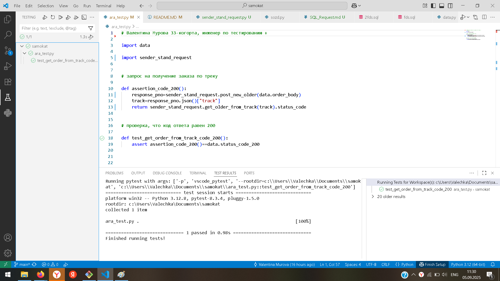

# Автоматизация теста к API

Валентина Мурова, 33-когорта, Инженер по тестированию+

## Автоматизируй сценарий:

- Клиент создаёт заказ.

- Проверяется, что по треку заказа можно получить данные о заказе.

## Шаги автотеста:

1. Выполнить запрос на создание заказа.

1. Сохранить номер трека заказа.

1. Выполнить запрос на получение заказа по треку заказа.

1. Проверить, что код ответа равен 200.

## Конфигурация:

1. URL: https://ba116d41-31f5-45e9-84ef-aeaac312a9de.serverhub.praktikum-services.ru

2. Работа в VS-коде с пакетами python : requests, pytest.

3. Команды запуска: 

- Подключение к серверу ssh c0b7112f-60de-4510-be2b-49634271ca8e@serverhub.praktikum-services.ru -p 4554

- Доступ к базе psql -U morty -d scooter_rent. Пароль: smith

- Запуск теста Running pytest with args: ['-p', 'vscode_pytest', '--rootdir=c:\\Users\\Valechka\\Documents\\samokat' 'c:\\Users\\Valechka\\Documents\\samokat\\ara_test.py::test_get_order_from_track_code_200']